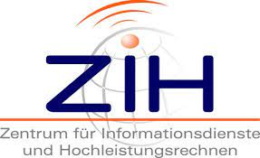

layout: true
  

  <table>
    <tr>
      <td style="text-align:right">Saxon State and University Library Dresden</td>
      <td>12th September 2022</td>
      <td style="text-align:right"><a href="https://www.slub-dresden.de/">www.slub-dresden.de</a></td>
    </tr>
    <tr>
      <td style="text-align:right">Open Science Department</td>
      <td />
    </tr>
  </table>

  <table>
    <tr>
      <td style="text-align:left"><b>Kay-Michael Würzner</b></td>
    </tr>
    <tr>
      <td style="text-align:left">Open Science Department</td>
    </tr>
    <tr>
      <td style="font-size:8pt"><b>12th September 2022</b></td>
    </tr>
    <tr>
      <td style="font-size:8pt">Lessons in Open Science</td>
    </tr>
  </table>

---

class: title-slide
count: false

# Open Science in a Nutshell
## SLUB Lessons in Open Science #1

---

# Overview

- What is *open science*?
    + Scientific method and open science practices
    + The openness puzzle
    + Pros and Cons
- The SLUB *Lessons in Open Science* series
    + Motivation
    + Topics, schedule, personnel

---

class: part-slide
count: false

# What is *open science*?

---

# What is *open science*?

.cols[
.fifty[
- Free and (un-)restricted access to **scientific research**
   + At all stages of the research process
   + Not restricted to STEM disciplines
       * **Open research**
       * **Open scholarship**
- With all its **advantages**, **risks** and **challenges**
]
.fifty[

]
]

---

# Scientific method and openness

- Multiple stages of the research process
- Corresponding open science practices

By Efbrazil - Own work, CC BY-SA 4.0, https://commons.wikimedia.org/w/index.php?curid=102392470

---

# Scientific method and openness

- Multiple stages of the research process
- Corresponding open science practices

By Efbrazil - Own work, CC BY-SA 4.0, https://commons.wikimedia.org/w/index.php?curid=102392470

---

# The openness puzzle

---

# Open Access

.cols[
.fifty[
- Free access to **research results and publications** and their (un-)restricted reusability
    + Well-established concept (approx. 60 % of TU publications are OA)
    + Various types of OA: *gold*, *green*, *diamond*
    + Adopted by commercial publishers
- Often mixed with other openness aspects
]
.fifty[

]
]

---

# Open Data

.cols[
.fifty[
- Free access to **research data** and their (un-)restricted reusability
    + Standardized metadata
    + Documentation!
    + Various existing publication platforms (i.e. *repositories*)
        * Institutional (e.g. `OpARA`)
        * Disciplinary (e.g. `PsychData`)
        * Universal (e.g. `Zenodo`)
]
.fifty[

By David Mellor!Original: AinaliVector: AntiCompositeNumber - https://osf.io/tvyxz/, CC BY 4.0, https://commons.wikimedia.org/w/index.php?curid=64318717

]
]

---

# Open Source

.cols[
.fifty[
- Free access to **research software** and their (un-)restricted reusability
    + Vast amount of possible licenses
    + Free use vs. modifiability
    + Adopted by software companies
- `GitHub` as the de-facto standard for publishing research software
]
.fifty[

]
]

---

# Open Evaluation

- Development of a **fair evaluation** system based on standardized protocols and transparent metrics
    + **Preregistration**: Early sharing of research questions and approach
    + Open methodology: Methods for data acquisition and analysis
    + Open peer review
        * Open identities of authors **and** reviewers
        * Published reviews
        * Wider contribution possibilities for the scientific community
- Alternatives for measuring scientific outreach
- Together with OA, OD, OS → **Open Reproducible Research**

---

# Open Educational Resources

.cols[
.fifty[
- Free access to **teaching and learning materials** and their (un-)restricted reusability
    + Not strictly part of Open Science
    + Important part of an **open academic culture**
- Dedicated platforms like `Opal` and aggregators like [`OERSI`](https://oersi.de/)
- Increased relevance during the covid-19 pandemic
    + Independent of time and location
    + **Barrier-free**
]
.fifty[

By Jonathasmello - Own work, CC BY 3.0, https://commons.wikimedia.org/w/index.php?curid=18460156

]
]

---

# Open Cultural Heritage

.cols[
.fifty[
- Free access to **archival holdings, library collections and works of art** and their (un-)restricted reusability
- Often granted through digitization
- Multi-dimensional access
    + Materiality!
- Including descriptions of the creative process and provenance
]
.fifty[

By Open Knowledge Foundation - http://openglam.org/files/2012/04/OpenGLAM-logo.png, CC BY 3.0, https://commons.wikimedia.org/w/index.php?curid=25209995

]
]

---

# Open X

- Not a complete picture
    + Open Innovation
    + Open Leadership
    + ...
- FAIR principles
    + Make it **findable**: *platform*
    + Care for **accessibility**: *documentation*
    + Mind the **interoperability**: *file format*
    + Clarify **reuse**: *license*
- **Openness is a demanding and challenging task.**
- Advantages
    + More feedback
    + More visibility
    + More efficiency

---

class: part-slide
count: false

# The SLUB *Lessons in Open Science* series

---

# The SLUB *Lessons in Open Science* series

- Omnipresent topic
- High demands by funding organisations
    + Horizon 2020 → Horizon Europe
    + DFG Guidelines for Safeguarding Good Research Practice
- Challenging for researchers and project scouts
    + Not yet part of daily scientific practice
- Closing the gap between claim and reality

---

# The SLUB *Lessons in Open Science* series

- Nine online talks between today and 23th September
    + Each at 1pm, 30 minutes incl. time for questions
        * One exception: Data Management Planning
    + With information on **concepts** as well as **technical and advisory services**
- Oriented to the [Horizon Europe programme guide](https://ec.europa.eu/info/funding-tenders/opportunities/docs/2021-2027/horizon/guidance/programme-guide_horizon_en.pdf)
- Held by experts from SLUB, the Service Center Research Data and SaxFDM

.cols[

]
.fifty[

]
]

---

# The SLUB *Lessons in Open Science* series

- Programme
    - Tuesday, 13th September: Henriette Mehn, Michaele Adam *Academic identity management*

---

count: false

# The SLUB *Lessons in Open Science* series

- Programme
    - Tuesday, 13th September: Henriette Mehn, Michaele Adam *Academic identity management*
    - Wednesday, 14th September: Simone Gruner, Eloisa Deola Schennerlein, Caprice Thomas *Green Open Access*

---

count: false

# The SLUB *Lessons in Open Science* series

- Programme
    - Tuesday, 13th September: Henriette Mehn, Michaele Adam *Academic identity management*
    - Wednesday, 14th September: Simone Gruner, Eloisa Deola Schennerlein, Caprice Thomas *Green Open Access*
    - Thursday, 15th September: Simone Gruner, Eloisa Deola Schennerlein, Caprice Thomas *Gold Open Access*

---

count: false

# The SLUB *Lessons in Open Science* series

- Programme
    - Tuesday, 13th September: Henriette Mehn, Michaele Adam *Academic identity management*
    - Wednesday, 14th September: Simone Gruner, Eloisa Deola Schennerlein, Caprice Thomas *Green Open Access*
    - Thursday, 15th September: Simone Gruner, Eloisa Deola Schennerlein, Caprice Thomas *Gold Open Access*
    - Friday, 16th September: Carolin Hundt, Johannes Sperling *Data Management Planning*

---

count: false

# The SLUB *Lessons in Open Science* series

- Programme
    - Tuesday, 13th September: Henriette Mehn, Michaele Adam *Academic identity management*
    - Wednesday, 14th September: Simone Gruner, Eloisa Deola Schennerlein, Caprice Thomas *Green Open Access*
    - Thursday, 15th September: Simone Gruner, Eloisa Deola Schennerlein, Caprice Thomas *Gold Open Access*
    - Friday, 16th September: Carolin Hundt, Johannes Sperling *Data Management Planning*
    - Friday, 16th September: Katharina Zinke *Pregistration and registered reports*

---

count: false

# The SLUB *Lessons in Open Science* series

- Programme
    - Tuesday, 13th September: Henriette Mehn, Michaele Adam *Academic identity management*
    - Wednesday, 14th September: Simone Gruner, Eloisa Deola Schennerlein, Caprice Thomas *Green Open Access*
    - Thursday, 15th September: Simone Gruner, Eloisa Deola Schennerlein, Caprice Thomas *Gold Open Access*
    - Friday, 16th September: Carolin Hundt, Johannes Sperling *Data Management Planning*
    - Friday, 16th September: Katharina Zinke *Pregistration and registered reports*
    - Monday, 19th September: Denise Dörfel *Research Data Management*

---

count: false

# The SLUB *Lessons in Open Science* series

- Programme
    - Tuesday, 13th September: Henriette Mehn, Michaele Adam *Academic identity management*
    - Wednesday, 14th September: Simone Gruner, Eloisa Deola Schennerlein, Caprice Thomas *Green Open Access*
    - Thursday, 15th September: Simone Gruner, Eloisa Deola Schennerlein, Caprice Thomas *Gold Open Access*
    - Friday, 16th September: Carolin Hundt, Johannes Sperling *Data Management Planning*
    - Friday, 16th September: Katharina Zinke *Pregistration and registered reports*
    - Monday, 19th September: Denise Dörfel *Research Data Management*
    - Tuesday, 20th September: Christian Löschen *Preservation and Publication of Research Data*

---

count: false

# The SLUB *Lessons in Open Science* series

- Programme
    - Tuesday, 13th September: Henriette Mehn, Michaele Adam *Academic identity management*
    - Wednesday, 14th September: Simone Gruner, Eloisa Deola Schennerlein, Caprice Thomas *Green Open Access*
    - Thursday, 15th September: Simone Gruner, Eloisa Deola Schennerlein, Caprice Thomas *Gold Open Access*
    - Friday, 16th September: Carolin Hundt, Johannes Sperling *Data Management Planning*
    - Friday, 16th September: Katharina Zinke *Pregistration and registered reports*
    - Monday, 19th September: Denise Dörfel *Research Data Management*
    - Tuesday, 20th September: Christian Löschen *Preservation and Publication of Research Data*
    - Thursday, 22th September: Caprice Thomas, Kay-Michael Würzner *Creative Commons Licences*

---

class: part-slide

# Many thanks for your attention!

<a href="https://wrznr.github.io/os-in-a-nutshell">wrznr.github.io/os-in-a-nutshell</a>

